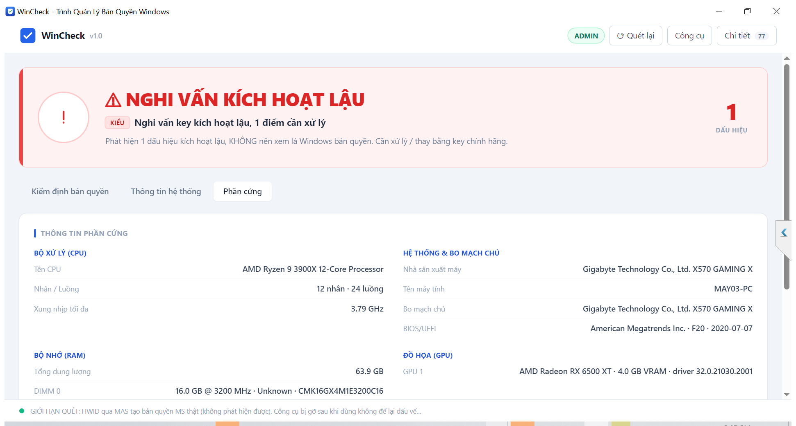

<div align="center">

# WinCheck Trình Quản Lý Bản Quyền Windows

**Windows của bạn có đang dùng key lậu không? Mở app là biết ngay.**

Ứng dụng desktop kiểm định bản quyền Windows, viết bằng Go + Wails + React, dành riêng cho thị trường Việt Nam.


[Ảnh chụp màn hình WinCheck]


**📱 Cần mua key bản quyền Windows + Office chính hãng? Liên hệ Zalo: [0352 194 195](https://zalo.me/0352194195)**

</div>

---

**Điều hướng:**
[Giới thiệu](#giới-thiệu) ·
[Mua key bản quyền](#mua-key-bản-quyền) ·
[Tính năng](#tính-năng) ·
[Yêu cầu](#yêu-cầu-hệ-thống) ·
[Cài đặt & Chạy](#cài-đặt--chạy) ·
[Xây dựng từ mã nguồn](#xây-dựng-từ-mã-nguồn) ·
[Kiến trúc](#kiến-trúc-dự-án) ·
[Kiểm thử](#kiểm-thử) ·
[Danh sách quét](#danh-sách-quét) ·
[Pháp lý](#thông-báo-pháp-lý)

---

## Giới thiệu

**WinCheck** trả lời **một câu hỏi duy nhất**: *Windows này có đang dùng key lậu không, và nếu có thì **kiểu gì**?*

Mở app lên là nó **tự nâng quyền Admin, tự quét và đưa ra phán quyết** ngay trên một màn hình full, không cần bấm gì:

- **Phán quyết lớn** với màu rõ ràng: `KHÔNG PHÁT HIỆN KÍCH HOẠT LẬU` (xanh), `NGHI VẤN KÍCH HOẠT LẬU` (đỏ, cảnh báo mạnh), `PHÁT HIỆN KÍCH HOẠT LẬU` (đỏ đậm).
- **Dòng "Kiểu"** trả lời vế *như thế nào*: KMS giả lập ngay trên máy, dịch vụ KMS lậu trên internet, TSforge (KMS4k), KMS38, GVLK vĩnh viễn, hook vá dịch vụ bản quyền, kênh điện thoại bất thường. Nếu máy sạch thì cho biết Windows được **kích hoạt hợp lệ bằng cách nào** (Digital Entitlement, KMS doanh nghiệp, Retail/OEM).
- **Bằng chứng cụ thể**: danh sách dấu hiệu (nghiêm trọng trước, cảnh báo sau) để bạn *tin được* kết luận.
- **Key Windows đầy đủ**: giải mã trọn 25 ký tự key đang cài từ `DigitalProductId`, chỉ mã hóa lại khi không đọc được, kèm key OEM BIOS và key dự phòng Registry.

Giao diện chia **3 tab** để không rối:

1. **Kiểm định bản quyền**: phán quyết, khuyến nghị, key, bảng tình trạng kiểm tra, danh sách dấu hiệu.
2. **Thông tin hệ thống**: ấn bản, kênh phân phối, trạng thái kích hoạt, phương thức, key đang dùng.
3. **Phần cứng**: thông tin chi tiết kiểu CPU-Z (CPU, bo mạch chủ, BIOS, RAM từng thanh, GPU, ổ đĩa).

Nhật ký kỹ thuật đầy đủ và các công cụ thay đổi bản quyền được **giấu trong ngăn kéo**, không làm rối màn hình chính.

Điểm nổi bật của WinCheck:

- 🖥️ **Ứng dụng native một tệp `.exe`**: backend Go + frontend React/TypeScript đóng gói qua Wails, chạy trên WebView2 tích hợp sẵn Windows. Không phụ thuộc runtime ngoài, không cần cài đặt, mở **full màn hình**.
- 🔧 **Chỉ dùng API Windows cấp cao**: không gọi PowerShell, `slmgr.vbs` hay `schtasks`. Mọi thứ đi thẳng qua **WMI/COM** (`SoftwareLicensingProduct`, `Win32_NTLogEvent`, `MSFT_ScheduledTask`…), **Software Licensing API** (`InstallProductKey` / `UninstallProductKey` / `ReArmWindows`), **Registry API** và **Token API**.
- ⚡ **Tập trung một câu trả lời**: thay vì đổ ra "tường chữ", app đưa ra một phán quyết kèm bằng chứng gọn gàng; chi tiết kỹ thuật chỉ hiện khi bạn bấm.
- 🇻🇳 **Chỉ tiếng Việt**: phát hành riêng cho thị trường Việt Nam, toàn bộ giao diện bằng tiếng Việt.
- 🧩 **Kiến trúc tách tầng**, logic nghiệp vụ tách khỏi Windows và GUI, **được kiểm thử tự động đầy đủ**.

> ⚠️ **Lưu ý an toàn:** các thao tác trong ngăn kéo **Công cụ** (cài key, gỡ key, rearm) thay đổi trạng thái bản quyền thật của Windows. Ứng dụng luôn hỏi xác nhận trước khi thực hiện. Chỉ dùng khi bạn hiểu rõ mình đang làm gì.

---

## Mua key bản quyền

WinCheck giúp bạn phát hiện Windows/Office đang dùng key lậu. Nếu cần **thay bằng key bản quyền chính hãng**, mình tư vấn và cung cấp:

- 🪟 **Windows**: 10 / 11 (Home, Pro, Education, Enterprise…)
- 📄 **Office**: 2016 / 2019 / 2021 / 365

Liên hệ Zalo để được tư vấn và báo giá:

📱 **Zalo: [0352 194 195](https://zalo.me/0352194195)**

📧 **Email: [lethetuanit.com@gmail.com](mailto:lethetuanit.com@gmail.com)**

🌐 **Website: [https://lethetuanpc.blogspot.com/](https://lethetuanpc.blogspot.com/)**

---

## Tính năng

### Kiểm định một chạm

Mở app là có ngay phán quyết. Bảng **tình trạng kiểm tra** liệt kê **12 mục**, mỗi dòng nói rõ *có phát hiện dấu hiệu crack không* kèm chi tiết: máy chủ KMS, cổng KMS, dịch vụ, tác vụ định kỳ, tập tin/thư mục công cụ, tiến trình, hook vá dịch vụ SPP, khóa GVLK & kênh, key cài đặt chung, hạn kích hoạt, kho tin cậy SPP, nhật ký sự kiện SPP.

### Các lớp phát hiện kích hoạt lậu

| Lớp | Kiểm tra | Phát hiện |
|-----|----------|-----------|
| ① | **Tên máy chủ KMS** (Registry + WMI) | KMS giả lập cục bộ (127.x), IP giả, tên miền KMS lậu đã biết, cloud KMS công cộng, Azure KMS |
| ② | **Cổng localhost** (mặc định 1688) | Dịch vụ KMS cục bộ đang lắng nghe; tự hạ mức trên Windows Server (có thể là KMS host chính hãng) |
| ③ | **Dịch vụ hệ thống** | Dịch vụ kích hoạt cài cố định (KMSpico, vlmcsd, AutoKMS, HEU_KMS, MicroKMS…) |
| ④ | **Tác vụ định kỳ** | Tác vụ tự động kích hoạt lại (AutoKMS, KMSAuto, AutoRearm…) |
| ⑤ | **Đường dẫn tập tin/thư mục** | Dấu vết cài đặt và tàn dư trên đĩa: SECOH-QAD, SppExtComObjHook, AutoKMS/KMSAuto/AAct_Tools, KMS_VL_ALL.inf, GenuineTicket |
| ⑥ | **Tiến trình đang chạy** | Công cụ kích hoạt đang hoạt động tại thời điểm quét |
| ⑦ | **Hook vá dịch vụ SPP** (IFEO) | `VerifierDlls`/`Debugger` gắn vào `SppExtComObj.exe`/`sppsvc.exe`: chữ ký của KMSpico và KMS_VL_ALL |
| ⑧ | **GVLK + kênh kích hoạt** | GVLK/placeholder + kích hoạt vĩnh viễn ⇒ TSforge/KMS38/HWID; kênh điện thoại bất thường (TSforge ZeroCID) |
| ⑨ | **Key cài đặt chung** | Key mặc định (ví dụ …Y4G6T) không tự kích hoạt được: dấu vân tay của kích hoạt kiểu KMS/HWID, cần xác minh |
| ⑩ | **Ngày hết hạn bất thường** | Năm ~2038 (KMS38), 2100+ (TSforge KMS4k), ~180 ngày (Online KMS) |
| ⑪ | **Dấu thời gian kho SPP** | `data.dat` sửa đổi ngoài ngữ cảnh Windows Update *(độ tin cậy thấp)* |
| ⑫ | **Nhật ký sự kiện SPP** | Event 12290: địa chỉ máy chủ KMS bên ngoài |

Danh sách chữ ký (dịch vụ, tiến trình, tác vụ, tệp, tên miền KMS lậu, hậu tố GVLK) được **tổng hợp từ nghiên cứu các bộ kích hoạt phổ biến** (KMSpico, KMS_VL_ALL, KMSAuto, AAct, Microsoft Toolkit, py-kms, vlmcsd, MAS) và tích hợp sẵn trong `.exe`.

### Công cụ thay đổi bản quyền (ngăn kéo)

| Thao tác | Quyền | Mô tả |
|----------|-------|-------|
| **Cài / thay key** | **Admin** | Xác thực và cài key mới qua Software Licensing API (`InstallProductKey`), chẩn đoán mã lỗi chi tiết |
| **Gỡ key** | **Admin** | Xóa key hiện tại (`UninstallProductKey` + `ClearProductKeyFromRegistry`) |
| **Đặt lại kích hoạt (Rearm)** | **Admin** | Reset đếm ngược kích hoạt (`ReArmWindows`) |
| **Dọn key dự phòng** | **Admin** | Xóa `BackupProductKeyDefault` cũ trong Registry (không ảnh hưởng kích hoạt hiện tại) |

**Giới hạn đã biết (không thể phát hiện):** HWID qua MAS tạo bản quyền số **thật** do Microsoft cấp, để lại trạng thái giống hệt một license số chính hãng nên không phân biệt được bằng máy cục bộ; công cụ đã gỡ sạch không để lại dấu vết; vá SLIC/OEM BIOS kiểu cũ. KMS doanh nghiệp hợp lệ có thể kích hoạt một số cảnh báo GVLK, hãy xác minh với bộ phận IT.

---

## Yêu cầu hệ thống

| | Giá trị |
|---|---|
| **Hệ điều hành** | Windows 10 (1903+) / Windows 11, kiến trúc x64 |
| **WebView2** | Runtime hiển thị giao diện: tích hợp sẵn Windows 11; Windows 10 có sẵn qua Edge |
| **Quyền khởi động** | **Bắt buộc Admin**: app tự kiểm tra và xin nâng quyền (UAC) ngay khi mở |
| **Nếu từ chối UAC** | App vẫn mở ở chế độ giới hạn và có nút nâng quyền lại bất cứ lúc nào |
| **Phụ thuộc runtime** | Không có: một tệp `.exe` chạy độc lập |

---

## Cài đặt & Chạy

1. Tải **`WinCheck.exe`**: một tệp `.exe` duy nhất, không có tệp đi kèm.
2. **Nhấp đúp** vào `WinCheck.exe`. App **tự kiểm tra quyền**: nếu chưa đủ quyền, nó tự khởi chạy lại và hiện **hộp thoại UAC xin quyền Admin**; khi được chấp nhận, app mở **full màn hình** với đầy đủ tính năng.
3. Ứng dụng **tự quét và đưa ra phán quyết ngay**, không cần bấm gì.
4. Muốn xem sâu hơn: nút **Chi tiết** (nhật ký kỹ thuật đầy đủ) và **Công cụ** (cài key, gỡ key, rearm, dọn key dự phòng).
5. Nếu từ chối UAC, app vẫn mở ở chế độ giới hạn; nút nâng quyền ở góc trên bấm được bất cứ lúc nào.

> Danh sách quét (cổng, dịch vụ, tiến trình, tệp, tên miền KMS lậu…) được **tích hợp sẵn trong `.exe`**, không cần tệp cấu hình bên ngoài.

---

## Xây dựng từ mã nguồn

### Yêu cầu

- [Go 1.23+](https://go.dev/dl/) (Windows/amd64), **không cần trình biên dịch C** (Wails trên Windows dùng go-webview2 thuần Go).
- [Node.js + npm](https://nodejs.org/) để build frontend React.
- **Wails CLI v2.12.0**:
  ```powershell
  go install github.com/wailsapp/wails/v2/cmd/wails@v2.12.0
  wails doctor   # kiểm tra môi trường
  ```

### Build

```powershell
# Build app native ra .\build\bin\WinCheck.exe
wails build

# hoặc dùng script tiện lợi (kèm chạy test):
.\build.ps1 -Test
# hoặc: make all
```

`wails build` tự động: sinh binding Go↔JS, `npm install`, build frontend (tsc + Vite), biên dịch Go và nhúng frontend vào một tệp `.exe`.

### Chế độ phát triển (hot-reload)

```powershell
wails dev        # hoặc: .\build.ps1 -Dev  /  make dev
```

> Bản clone sạch đã kèm placeholder `frontend/dist/.gitkeep` để `go build` và `go test ./...` chạy được ngay; `wails build`/`wails dev` sẽ tự sinh lại `frontend/dist` đầy đủ.

---

## Kiến trúc dự án

Dự án tách bạch **logic thuần** (kiểm thử được, không phụ thuộc Windows) khỏi **tầng tích hợp Windows** và **GUI**.

```
WinCheck-Golang/
├── main.go                       # Điểm vào Wails (wails.Run, cấu hình cửa sổ, nhúng frontend)
├── app.go                        # App: bind method cho React (GetStatus/Scan/RunOption…) + dựng phán quyết
├── tools/genicon/                # Trình vẽ icon ứng dụng (nguyên gốc, không dùng ảnh có bản quyền)
├── wails.json                    # Cấu hình Wails
├── frontend/                     # Giao diện React + TypeScript (Vite + Tailwind)
│   ├── src/App.tsx               # Toàn bộ UI: dashboard phán quyết, 3 tab, ngăn kéo, hộp thoại
│   └── wailsjs/                  # Binding Go↔JS tự sinh (model + phương thức)
├── internal/
│   ├── i18n/                     # Bảng chuỗi tiếng Việt (một nơi duy nhất)
│   ├── logx/                     # Mô hình dòng nhật ký (Line/Kind/Emitter), tách logic khỏi GUI
│   ├── config/                   # Danh sách quét mặc định tích hợp sẵn (không đọc tệp ngoài)
│   ├── license/                  # Che/giải mã key, kiểm định dạng, GVLK, phương thức kích hoạt
│   ├── audit/                    # Quét bên thứ ba: phân loại KMS/hết hạn/IP + điều phối các lớp
│   ├── ops/                      # Thao tác key: điều phối qua Provider + Interaction
│   ├── sysinfo/                  # Interface Provider + hiện thực Windows (WMI/COM + Software Licensing API)
│   └── testprovider/             # Provider & Interaction giả lập cho kiểm thử
├── build/                        # Tài nguyên build của Wails (icon…); build/bin/ = output .exe
├── build.ps1 / Makefile          # Script build
└── README.md / LICENSE
```

**Ý tưởng cốt lõi:** mọi logic nghiệp vụ chỉ phụ thuộc vào interface `sysinfo.Provider` và phát ra các đối tượng `logx.Line` mang ý nghĩa ngữ nghĩa. Nhờ đó:

- **Tầng logic** (`audit`, `ops`, `config`, `license`) chạy và kiểm thử trên **mọi nền tảng** với một `Provider` giả lập, không cần Windows thật.
- **Backend Wails** (`app.go`) chỉ bao mỏng tầng logic: `Scan()` chạy `audit` với một `Provider` thật rồi dựng đối tượng phán quyết cho React; các thao tác key chạy `ops` và **phát mỗi `logx.Line` qua sự kiện Wails** (`EventsEmit`).
- **Frontend React** (`App.tsx`) gọi `Scan()` ngay khi mở để hiển thị phán quyết, lắng nghe sự kiện `log` để đổ nhật ký kỹ thuật theo màu.
- Vì logic độc lập với GUI và với backend hệ thống, có thể **thay GUI hoặc thay backend `sysinfo`** mà không đụng tới `audit`/`ops`/`config`/`license` và bộ test của chúng.

---

## Kiểm thử

Toàn bộ tầng logic được kiểm thử tự động:

```bash
go test ./...            # chạy test
go test -cover ./...     # kèm độ phủ
```

| Gói | Nội dung kiểm thử |
|-----|-------------------|
| `i18n` | Tra chuỗi, định dạng tham số, không có mục rỗng |
| `logx` | Emitter, đóng khung hành động, sink |
| `license` | Che/giải mã key (vector `DigitalProductId` thật), kiểm định dạng, GVLK, phương thức kích hoạt |
| `audit` | Phân loại KMS, phân tích hết hạn, hook IFEO, key cài đặt chung, điều phối các lớp qua Provider giả |
| `config` | Parse định dạng INI, hợp nhất danh sách, dedupe không phân biệt hoa thường |
| `ops` | Các thao tác key với Provider + Interaction giả (thành công, lỗi, hủy) |
| gốc (`app.go`) | Dựng phán quyết (buildFacts/buildKeys/buildHardware/buildRecommendation/piracyType), uiStrings |

> `sysinfo` (tích hợp Windows) được xác nhận bằng chạy thực tế trên Windows 10 vì cần WMI/COM + Registry thật; toàn bộ tầng điều phối phía trên nó đã được phủ bằng Provider giả lập, và bản thân app Wails được kiểm chứng bằng chạy thật (tự quét và ra phán quyết khi mở).

---

## Danh sách quét

Ứng dụng dùng **danh sách quét tích hợp sẵn** trong `.exe`: cổng KMS, tên dịch vụ/tiến trình/tác vụ đáng ngờ, đường dẫn tệp/thư mục activator, tên miền KMS lậu công cộng và tập hậu tố GVLK/HWID đã biết (xem [`internal/config/settings.go`](internal/config/settings.go) và [`internal/audit/audit.go`](internal/audit/audit.go)). Không cần tệp cấu hình bên ngoài; toàn bộ ứng dụng gói gọn trong **một tệp `.exe` duy nhất**.

---

## Thông tin phần cứng

Tab **Phần cứng** hiển thị thông tin chi tiết kiểu CPU-Z, đọc qua WMI:



- **CPU**: tên, số nhân/luồng, xung nhịp tối đa.
- **Hệ thống & bo mạch chủ**: nhà sản xuất, model, tên máy, mainboard, BIOS/UEFI (phiên bản + ngày).
- **RAM**: tổng dung lượng và từng thanh (dung lượng, tốc độ, hãng, part number).
- **GPU**: tên, VRAM, phiên bản driver.
- **Ổ đĩa**: model, dung lượng, loại.

---

## Mô hình nâng quyền

Ứng dụng **xin quyền Admin ngay khi mở** (`main.go`):

1. Khởi động, app **kiểm tra quyền hiện tại** (`provider.IsAdmin()`).
2. **Đủ quyền** → mở app bình thường với đầy đủ tính năng.
3. **Chưa đủ quyền** → app **tự khởi chạy lại chính nó** qua UAC bằng `ShellExecute` với động từ `runas`, rồi đóng phiên hiện tại. Cờ `--relaunched` được truyền kèm để **chống lặp vô hạn** nếu lần nâng quyền vẫn không có Admin.
4. **Từ chối UAC** → app vẫn mở ở **chế độ giới hạn** (không để người dùng mắc kẹt), nút nâng quyền hiện ở góc trên để thử lại.

> Lưu ý: trên máy có chính sách UAC đặt *"Elevate without prompting"* (`ConsentPromptBehaviorAdmin = 0`), Windows nâng quyền **im lặng**, bạn sẽ không thấy hộp thoại UAC mà app mở thẳng ở chế độ Admin.

---

## Thông báo pháp lý

Sử dụng Windows **không có bản quyền chính hãng** mua từ Microsoft hoặc đại lý được ủy quyền **vi phạm Điều khoản dịch vụ của Microsoft** (EULA §4). WinCheck là công cụ **kiểm tra và chẩn đoán**, nó **không** kích hoạt lậu Windows; phần quét chỉ **phát hiện** dấu hiệu kích hoạt bên thứ ba nhằm giúp bạn xác minh tính hợp lệ của hệ thống.

- Người dùng doanh nghiệp / OEM: xác minh bản quyền với bộ phận IT hoặc nhà cung cấp.
- Kiểm tra trạng thái bản quyền chính hãng: <https://aka.ms/MyAccount>.

---

## Giấy phép

Phân phối theo giấy phép **[MIT](LICENSE)**.

<div align="center">
  <sub>WinCheck, Trình Quản Lý Bản Quyền Windows · Tác giả: Lê Thế Tuấn · Viết bằng Go cho thị trường Việt Nam 🇻🇳</sub>
</div>
